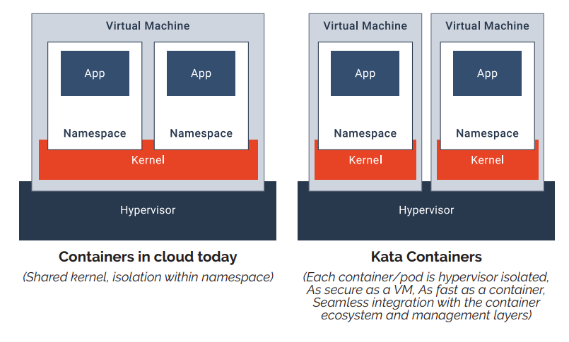
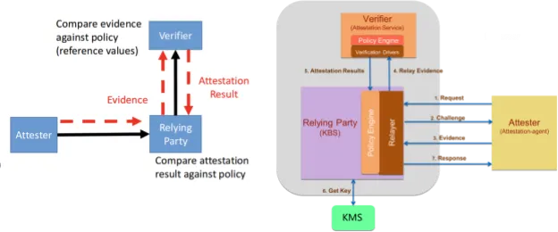
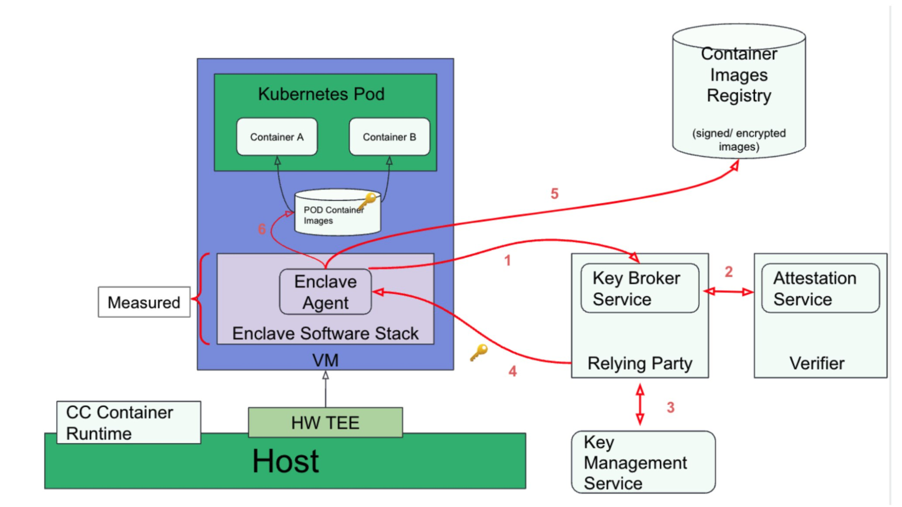
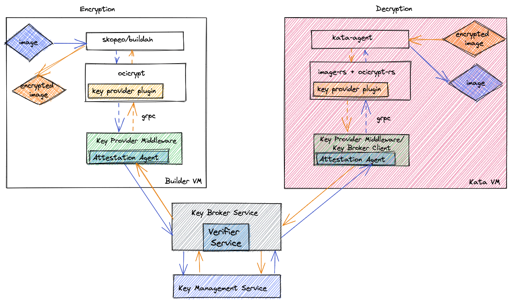
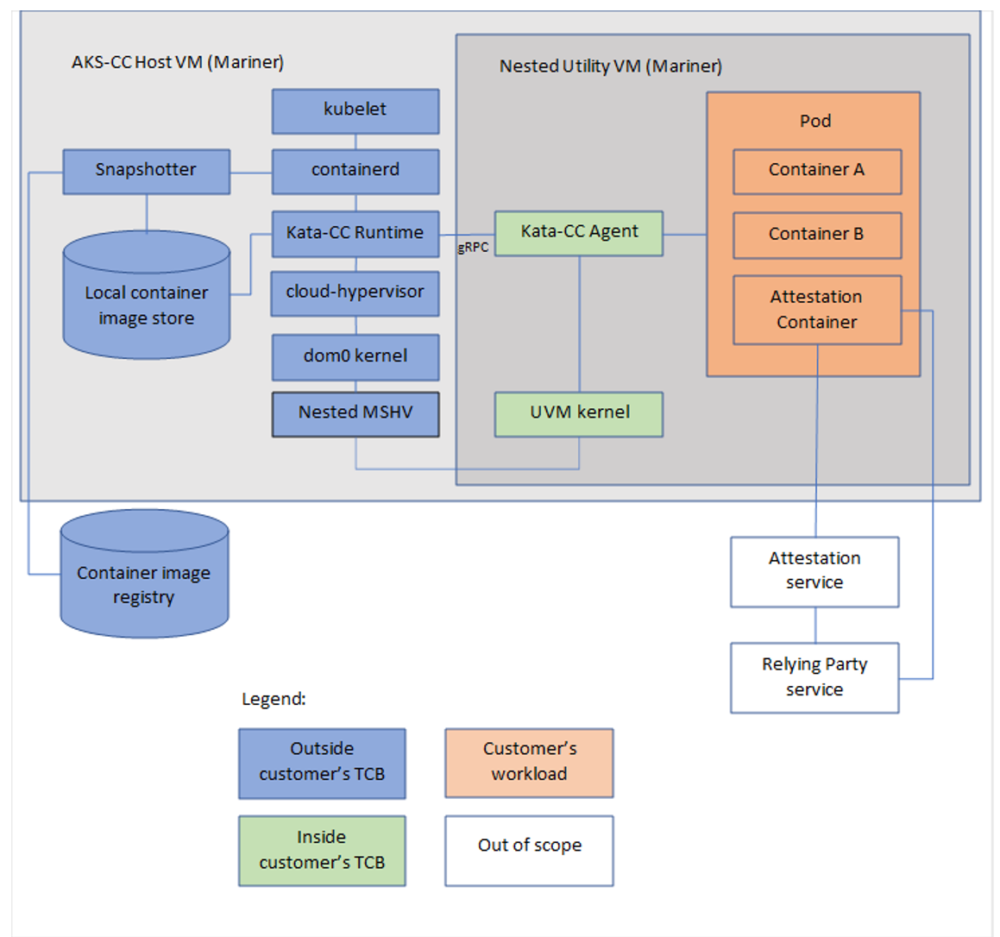
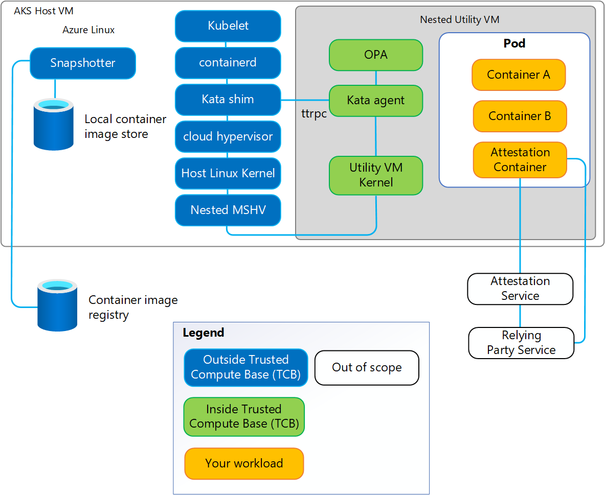
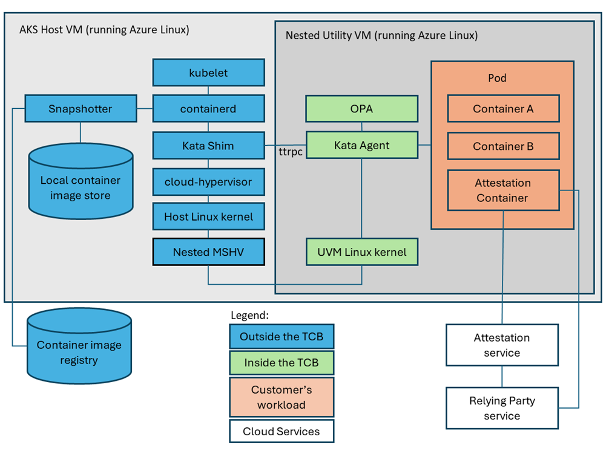
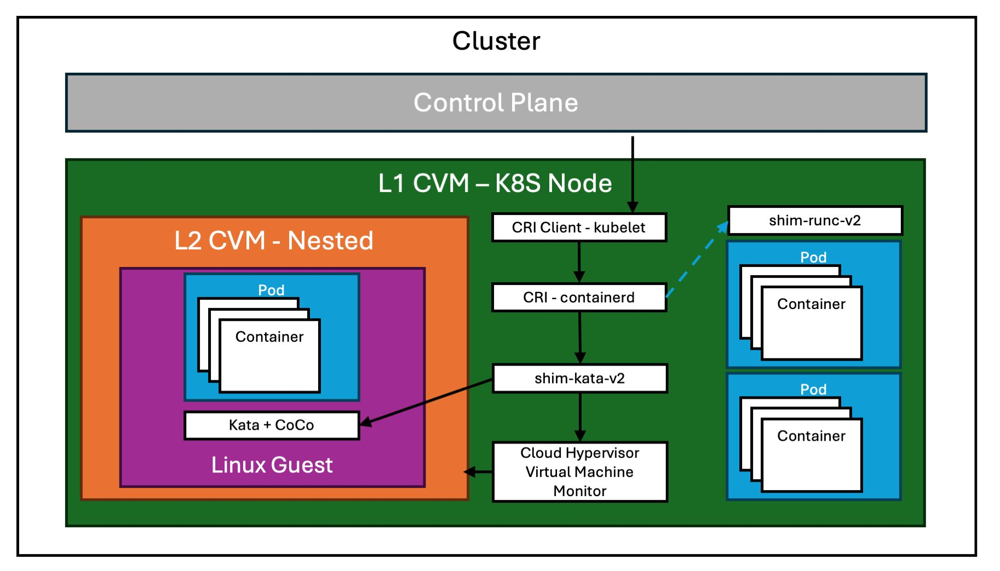
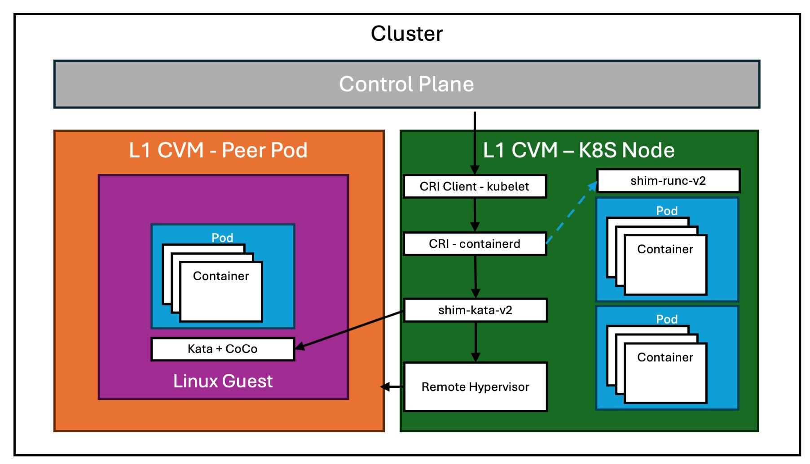

# Kata Containers

**Kata Containers** is an open-source project providing lightweight virtual machines (VMs) with the agility and speed of traditional containers. By merging hardware virtualization and containerization, Kata offers stronger isolation while retaining near-native performance. It originated from two projects:
* **Intel Clear Containers**, which introduced lightweight VMs tailored for container security.
* **Hyper-V runV**, which prioritized being technology-agnostic by supporting many different CPU architectures and hypervisors.

## Motivation
* Multi-tenant isolation: When many containers belonging to different tenants (users or businesses) run on the same Kubernetes node, they share the same kernel. A kernel exploit or misconfiguration could allow one container to affect another or the host. Many organizations seek stronger isolation than just Linux namespaces.
* Goal: Leverage the strong isolation of virtual machines (each VM has its own kernel) while retaining the speed and efficiency of containers. VMs typically add overhead and slower startup times, whereas containers start quickly but share the host kernel.
* Kata Containers: A drop-in container runtime (like runc) that, instead of launching a container process directly on the host, launches a small VM for that container or pod.

## Key Advantages and Features
1. Lightweight VMs with Container Performance: Each container runs inside its own minimal VM, leveraging a lean guest OS and kernel. This approach allows near-native performance, much like Docker or Kubernetes containers.
2. Enhanced Security and Isolation: Kata relies on hardware virtualization to provide a strict boundary between the host and container. This boundary is stronger than standard Linux namespaces alone.
3. Compatibility with Container Ecosystems: Kata integrates seamlessly with standard container interfaces (OCI-spec containers, CRI for Kubernetes). This compatibility makes adoption easier in existing CI/CD and orchestration pipelines.
4. Minimal Overhead: The specialized lean guest kernel and minimal OS reduce memory and CPU overhead compared to typical full-blown VMs.

## Kata Confidential Containers
Kata Confidential Containers extend the baseline Kata approach by incorporating Trusted Execution Environments (TEEs) to strengthen isolation and protect data in use. This confidential computing flavor of Kata leverages hardware-based technologies (e.g., Intel TDX, AMD SEV-SNP) so that a container’s memory remains encrypted and inaccessible to entities outside its TEE boundary.

### Dedicated VM per Pod
Instead of sharing the host kernel, each pod runs in its own micro-VM with an isolated guest kernel. On hardware that supports confidential computing (e.g., Intel TDX, AMD SEV-SNP, etc.), the micro-VM can run inside a TEE so that:
* The guest memory is encrypted and protected at the hardware level.
* Even privileged operations on the host cannot read or modify what is inside the micro-VM.
With each pod in its own dedicated kernel and TEE boundary, even a privileged user on the host OS (or a hypervisor process) cannot read the memory of a running confidential container.

### Core Components in the VM-Based CoCo Stack
1. Kata Containers
    * An open-source community that builds a secure container runtime using lightweight VMs.
    * Utilizes QEMU or Cloud Hypervisor behind the scenes.
    * The CoCo Kubernetes operator manages the deployment of Kata binaries and configuration.
2. Cloud API Adaptor
    * An extension to the Kata container runtime, allowing the creation of “peer-pods” using cloud provider APIs.
    * This means you can spawn a dedicated confidential VM in the cloud instead of running nested virtualization locally.
3. Attestation Agent
    * Facilitates remote attestation and secure key release by acting as a Key Broker Client (KBC) with the Key Broker Service (KBS).
    * Provides an abstraction layer for different TEE types, unifying evidence gathering for other CoCo components.
4. Confidential Data Hub
    * A modular component offering a RESTful API endpoint for other modules (e.g., kata-agent or application containers).
    * Supports Key Management Service, Key Broker Service, and Key Vault Service.
    * Can unseal Kubernetes sealed secrets and serve as a trusted storage service for encrypted data.
5. Container Image Snapshotter
    * In baseline CoCo stacks, container images can be pulled inside the Utility VM (UVM), which increases resource usage and TCB size.
    * To address this, a snapshotter (e.g., tardev-snapshotter) retrieves container image layers outside the TEE boundary.
    * Exposes container layers as read-only block devices protected by dm-verity, and the Kata agent enforces policies (e.g., verifying root hash) before mounting.

Below is a high-level architectural diagram (in concept) showing these components and how they fit together for VM-based CoCo.

## Attestation in Kata Confidential Containers
Attestation is at the heart of confidential computing because it provides a way for a workload owner to verify that the hardware and software environment running their workload is trustworthy. In other words, attestation ensures that only known and verified components are running inside the TEE-protected environment—thereby guarding sensitive data and code from untrusted infrastructure providers or external attackers.

Kata Confidential Containers (often referred to as CoCo) follows a hardware-based attestation flow. Here, the confidential computing processor (e.g., AMD SEV-SNP, Intel TDX) generates cryptographic evidence describing the guest environment. This evidence is then verified by the workload owner. If trusted, the workload owner provisions any required secrets, such as container image encryption keys.

The Confidential Containers project follows the IETF Remote Attestation Procedures (RATS) “background check” model. Under this model, an Attester (the confidential guest VM) sends evidence to a Relying Party (which typically includes a Key Broker Service and an Attestation Service) to prove trustworthiness. If the verification passes, the Relying Party releases secrets or tokens that enable the workload to run securely.

### Key Roles in the Attestation Process
Attester
* The entity (software running on a device, in a VM, etc.) seeking attestation. In CoCo, the Attester is the Confidential Containers guest—specifically, the in-guest attestation agent.
* It sends an Evidence—a cryptographically signed set of claims about the TCB (firmware, bootloader, kernel version, etc.)—to the Verifier.
* Attestation Agent in Kata CoCo implements the Attester logic.

Relying Party (Key Broker Service or KBS)
* A trusted service running externally (on the same cluster or on a separate infrastructure) that decides whether to release secrets to the Attester based on attestation results.
* Relies on a Verifier (Attestation Service) to assess the validity of the Evidence.
* Once verified, it retrieves the necessary secrets (e.g., container image decryption keys) from a Key Management Service (KMS) and provides them to the Attester.

Verifier (Attestation Service)
* Verifies the Attester’s Evidence against reference “good” values.
* Once satisfied, produces an Attestation Result which is sent back to the Relying Party to finalize the decision on whether to release secrets.

Key Management Service (KMS)
* Stores, manages, and backs up cryptographic keys.
* On successful attestation, the Relying Party fetches the requested keys from the KMS and releases them to the Attester.

### Threat Model for Kata Confidential Containers
Agents
* In a typical Kubernetes context, the infrastructure provider (e.g., a public cloud provider) is trusted.
* In confidential computing, that assumption is discarded—the infrastructure provider is a potential threat.

Assets
* Kubernetes pod container images
* Data generated or stored by the pod at runtime

### Threat Vectors
* The infrastructure provider tampers with or reads container images (while pulling or storing).
* The infrastructure provider tampers with or reads the pod’s memory.
* The infrastructure provider tampers with or reads data stored by the pod (e.g., volumes).

A critical departure from standard Kubernetes assumptions is that the infrastructure provider and the Kubernetes control plane are untrusted. Hence, the container image pulling and decryption must occur entirely within the TEE, ensuring the infrastructure provider cannot see or modify the images in transit or in memory.

For instance, an attacker or cloud admin with root access to the host’s hypervisor might try to inspect the VM memory. With CoCo, hardware-based memory encryption (SEV-SNP, TDX, etc.) and attestation prevent them from reading or injecting code into the TEE, thereby thwarting such attacks.

### Mitigations
1. Signed or Encrypted Container Images
    * The host or infrastructure owner must not manage or have direct access to container images.
    * The CoCo guest itself pulls and decrypts the images using keys released only if attestation succeeds.
2. Confidential Memory
    * The workload runs exclusively in encrypted memory, preventing the infrastructure from snooping or modifying runtime data.
3. Trusted Storage
    * Pod volumes must be encrypted and integrity protected.
    * CoCo requires that volumes use secrets obtained via attestation to unlock them, preventing tampering by the infrastructure provider.

Attestation Architecture and Flow
Why Attestation Matters for Container Images
The pod container images are the core asset to protect. In CoCo:

Only the CoCo guest is measured and attested, not the container images themselves.
Container images are encrypted or signed by an entity the workload owner trusts.
When the guest (Attester) requests keys, it undergoes remote attestation before the Relying Party will release them.
By not measuring multi-gigabyte container images (which would be CPU-intensive and slow startup times), CoCo stays more flexible and cloud-native.

### High-Level Steps
1. VM Startup
    * The Kata Containers runtime on the host starts a new micro-VM (the “CoCo guest”).
2. Guest Boot
    * The firmware, kernel, and other measured components of the guest are loaded, producing a set of TCB measurements.
3. Pulling Container Images
    * Inside the TEE, the kata-agent uses image-rs to parse the container image manifest.
    * For encrypted layers, ocicrypt-rs asks the Attestation Agent for the decryption key.
4. Remote Attestation
    * The Attestation Agent challenges the Relying Party (Key Broker Service).
    * The Relying Party issues an attestation challenge back.
    * The Attestation Agent responds with cryptographically signed Evidence from the confidential computing hardware.
    * The Relying Party forwards this Evidence to the Attestation Service (Verifier), which checks it against reference values.
    * If the Evidence is valid, the Relying Party retrieves the relevant decryption key from the KMS and wraps it for the CoCo guest.
5. Decryption and Container Startup
    * Once the keys are available, the Attestation Agent decrypts or verifies the container layers.
    * The kata-agent unpacks the container images and starts the pod containers inside the micro-VM.

In summary, once the CoCo guest proves it is running a trusted, measured software stack, it gains access to the secrets needed to decrypt or verify its container images. This ensures that the infrastructure provider cannot see or tamper with the workload.

### Implementation Details
Several open-source components come together to enable Kata Confidential Containers attestation:
1. attestation-agent
    * The main attestation component. 
    * Initiates the attestation process and communicates with the Key Broker Service (KBS).
    * Follows a modular architecture to support multiple attestation protocols.
    * The attestation-agent follows a modular architecture, allowing multiple Key Broker Client (KBC) plug-ins for different attestation protocols and different TEEs (e.g., AMD SEV, Intel TDX). This means the same Kata Confidential Containers guest can support multiple hardware vendor flows without needing a separate agent binary for each TEE.
2. image-rs
    * A container image management library that pulls, unpacks, verifies, or decrypts container images inside the CoCo guest.
    * Relies on ocicrypt-rs for encryption/decryption tasks.
3. ocicrypt-rs
    * Implements the OCI container image encryption specification
    * Serves as a “key provider” to image-rs, delegating key retrieval to the Attestation Agent.
4. reference-kbs
    * A reference implementation of the Key Broker Service (Relying Party).
    * Defines the protocol and API used by the Attester to obtain secrets after successful verification.

When a user creates a Kubernetes pod with an encrypted container image, the kata-agent coordinates with these components (image-rs, ocicrypt-rs, attestation-agent, KBS, KMS) to validate the TEE environment and securely retrieve decryption keys before launching the container workload.

## Confidential Containers on AKS
When it comes to Azure Kubernetes Service (AKS), CoCo leverages AMD SEV-SNP memory encryption for pods in TEEs, using Kata Containers for confidential workloads. This allows:
* Transparency: You can audit the entire trusted computing base (TCB). All TCB components are open source.
* Auditability: You can verify the versions of all CoCo (Confidential Container) environment components (Linux Guest OS, container runtime, etc.). Microsoft signs the guest OS and container runtime for attestation, also publishing secure hashes (SHA) for auditable build histories.
* Full Attestation: Hardware-based attestation from AMD SEV-SNP verifies that the correct OS image and runtime configuration are being used.
* Code Integrity: Strict policy enforcement with container signing and immutable policies.
* Isolation from Operators: The design assumes least privilege and maximum isolation from untrusted parties—including admins. 

### Components
The below architecture diagram shows how confidential pods sit on top of the Azure Linux Container Host and Cloud Hypervisor, which in turn run on TEE-capable hardware for memory encryption and attestation.

* Kata "CoCo" Agent: A special agent inside the micro-VM for confidential pods.
* Azure Linux AKS Container Host: The micro-VM runs atop an Azure Linux-based container host. The underlying Cloud Hypervisor (VMM) creates and manages these short-lived VMs.
* Memory Encryption: SEV-SNP hardware encrypts the micro-VM’s memory so host processes cannot read it, even with root privileges.
* Container-Level Isolation in AKS: By default, all workloads in AKS share the same kernel.

### Confidential Nested VMs
Running Kata Containers on Azure is made possible by the Pod Sandboxing feature in AKS. It leverages nested virtualization for improved isolation:
* Each pod runs inside a nested confidential child VM that is tied to the pod’s lifecycle. The outer VM (the AKS agent node) is itself a confidential VM, ensuring multiple layers of isolation.
* This feature requires specialized AMD SEV-SNP Confidential Child VM SKUs that support nested virtualization

In scenarios without nested virtualization support (or when you prefer a different architecture), you can use the Cloud API Adaptor to spawn an entirely separate confidential VM in a cloud environment. This approach:
* Uses Kata’s “peer-pods” feature to provision a separate Confidential VM in the public cloud when a new pod is created.
* Allows you to isolate container workloads without requiring nested virtualization.
* Can incur higher cloud costs but often yields good performance and scalability benefits.

### Security Policy for Kata Confidential Containers
In Confidential Computing, the goal is to protect data in use by running computations inside a hardware-attested TEE. On AKS, Confidential Containers implement this principle by running each Kubernetes pod inside a Utility VM (UVM) protected by AMD SEV-SNP.

The security model in CoCo (and specifically on AKS) enforces policy decisions within the TEE boundary using the Kata agent. This agent is part of the Trusted Computing Base (TCB) and relies on the Open Policy Agent (OPA) to block or allow specific container operations. Because the agent is part of the Trusted Computing Base (TCB), it must protect itself from potentially malicious inputs or APIs from components outside the TEE (e.g., Kata shims or container runtimes on the host).

1. Policy Specification
    * Written in the Rego policy language.
    * Annotated into your pod manifest.
    * Defines container images, valid commands, environment variables, mount points, etc.
    * Lists APIs that the pod intentionally blocks for confidentiality.
    * Identifies valid container configurations (e.g., read-only root filesystem, no new privileges, etc.).
    * For each API, a default allow/deny is defined if the rules do not explicitly grant permission.
        * default CreateContainerRequest := false (deny by default)
        * default GuestDetailsRequest := true (allowed by default since it isn’t sensitive)
2. Policy Enforcement
    * Each ttrpc API call to the Kata agent is checked by OPA.
    * If the parameters don’t match the allowed set, OPA denies the request, and the agent returns a “blocked by policy”.
    * This ensures that the runtime outside the TEE cannot coerce the agent into misconfiguring the container.
3. Policy Delivery and Attestation
    * The host (e.g., Kubelet + containerd + Kata shim) passes the Rego policy into the TEE.
    * A SHA256 hash of the policy is stored in a TEE-bound field, and the agent verifies that the policy file matches the hash at boot.
    * During remote attestation, an SEV-SNP attestation report includes this policy hash, ensuring external services can verify the correct policy is in place.

#### How the Policy is Delivered
All AKS Confidential Container UVMs begin with a generic default policy in the UVM’s root file system. However, each user pod requires its own policy:
1. You embed the policy text (Rego) in your Kubernetes YAML manifest.
2. This annotation flows through the kubelet, containerd, and the Kata shim to the agent inside the TEE.
3. The agent (with OPA) enforces that policy on every API call.

Because these host components (kubelet, containerd, Kata shim) are outside the TEE, the policy they carry is initially untrusted. You must establish trust in the policy via remote attestation.

#### Establishing Trust Through Attestation
1. Immutable Hash Binding
    * The Kata shim computes a SHA256 hash of the policy document before creating the UVM.
    * That hash is written into a TEE-bound field in the micro-VM’s hardware context. This field cannot be modified later.
2. Policy Verification
    * When the UVM boots, the Kata agent verifies that the policy’s contents match the TEE-bound hash. Any mismatch leads to policy rejection.
3. Remote Attestation
    * Before handling sensitive data, the workload container can request an attestation report from AMD SEV-SNP.
    * This cryptographically signed report includes:
        * The measurement of the OS and agent versions.
        * The immutable policy hash from the TEE field.
    * External systems (Relying Parties) can verify that the container is running with the correct OS version, correct Kata agent, and the correct security policy.

While the AKS platform includes the building blocks for confidential containers, customers can build or integrate their own attestation services on top. For instance:
* Azure Attestation Service: Microsoft provides an attestation service that can verify the SEV-SNP attestation report from the child VM, confirm the TCB, measure the Kata UVM image, and then securely release keys.
* Generic Attestation Clients: You can also bring your own attestation logic. The AMD SEV-SNP signed attestation report can be validated by any verifying service that trusts the AMD root of trust.

#### Container Image Snapshotter Considerations
In the baseline Confidential Containers stack, container images are often fetched inside the Utility VM. This can increase resource utilization, bloat the TCB, and limit performance. To address these issues, we use the Tardev-Snapshotter, which:
* Fetches encrypted/signed container images on the container host (outside the TEE).
* Device Mapping + dm-verity: Each layer is presented to the child VM as a read-only virtio block device. The Kata Agent verifies integrity using dm-verity. The root hashes of these layers are included in the policy, ensuring they become part of the measurement.
* Mount via tarfs: Inside the child VM, the agent uses a custom tarfs kernel module to mount these block devices as file systems. This approach keeps the TCB minimal and prevents the overhead of pulling large images inside each child VM.

The genpolicy tool downloads the container image layers for each container specified by the input Kubernetes pod manifest and calculates the dm-verity root hash value for each layer. This way, each mapped container image layer becomes part of the TCB measurement. 

#### Policy Enforcement
Once the policy is loaded and trusted, all calls to the Kata agent’s ttrpc APIs are sent to OPA with the relevant inputs (e.g., container image, mounts, environment variables). If the rules allow it, the agent proceeds; if not, the agent blocks it.

Example: If your policy states that a container must not mount a writeable /sys directory, any attempt to do so will fail the OPA check and be rejected.

By coupling policy-based enforcement with a hardware-enforced TEE, you minimize the risk of someone tampering with the container settings or reading memory contents, even if they control the Kubernetes node or hypervisor.

### Putting It All Together
By blending Kata Containers with Azure’s Confidential Containers on AKS, you gain:
* Transparency and Auditability: The entire TCB for the nested confidential VM is open source and can be measured, reproduced, and attested.
* Hardware-based Isolation: With AMD SEV-SNP, your workloads run in hardware-encrypted memory, beyond the reach of infrastructure administrators.
* Granular Security Policies: The in-TEE policy enforcement ensures that only approved commands and configuration are allowed for each confidential pod.
* Minimal TCB Through Snapshotting: Offloading container image pulls outside the TEE while verifying integrity via dm-verity reduces resource usage and lowers the attack surface.
* Attestation for Trust: Workload owners verify the correct software stack is running before releasing secrets, ensuring end-to-end confidentiality.

This powerful combination of nested confidential virtualization on Azure, the Kata Containers runtime, and Open Policy Agent–based security policies helps ensure your containerized workloads remain confidential—even in a multi-tenant environment with untrusted hosts or operators.