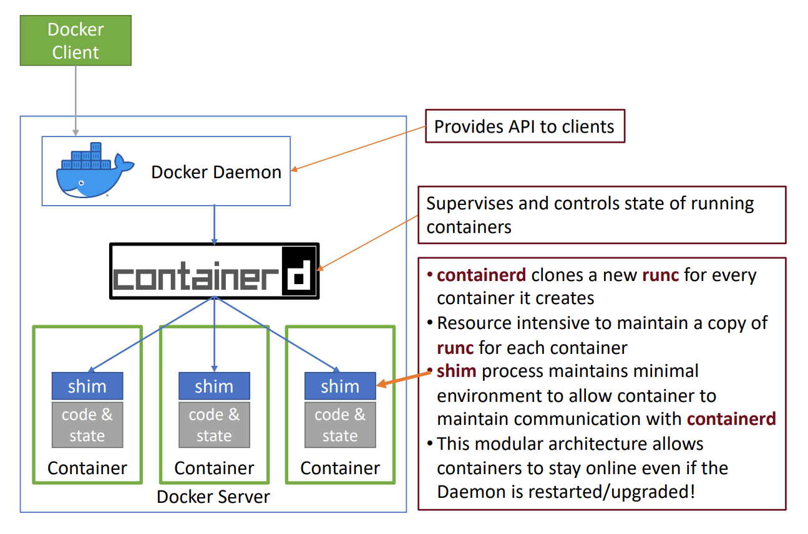

# Containers

## Open Container Initiative (OCI)
1. Purpose: The OCI sets open industry standards for container formats and runtimes.
    * Image specification: Defines how container images are packaged.
    * Runtime specification: Defines how containers are started, stopped, and managed.
2. Implementations:
    * runc: Provides a low-level CLI wrapper around libcontainer to directly run OCI-compliant containers. Lightweight but “bare bones” compared to Docker’s API.
    * containerd: Added support for OCI-compliant images, converting Docker images to OCI bundles under the hood.

## Linux Kernel Features Underlying Containers 
### Namespaces
* Goal: Provide isolation of resources so that each container sees only its own environment.
* Types of Namespaces (seven total; cgroups is separate):
    * mnt – Isolates mount points/filesystems.
    * pid – Provides independent process IDs (PID 1 inside the container).
    * ipc – Separates inter-process communication (shared memory, semaphores).
    * user – Separates user IDs and privileges across containers.
    * net – Virtualizes network stack (e.g., multiple lo interfaces).
    * uts – Splits host and domain name (UNIX time sharing).
    * cgroups – Often listed separately; manages resource usage limits.

### Control Groups (cgroups)
* Purpose: Group-level resource allocation, limiting, prioritization, accounting, and process control.
    * Resource limiting (e.g., memory, disk cache).
    * Prioritization (e.g., CPU shares, I/O throughput).
    * Accounting (e.g., track usage for billing or scheduling).
    * Control (e.g., pause/resume processes, checkpoint/restore).
* Hierarchy: Child groups inherit parent resource constraints.
* Controllers: (e.g., “memory” to limit memory usage, “cpuacct” to track CPU usage).
* cgroup filesystem: Typically mounted at /sys/fs/cgroup; can browse container resource usage there.

### seccomp (Secure Computing)
* Definition: A kernel mechanism (since version 3.12) that restricts the set of system calls a process can make.
* Purpose: Prevent a compromised container process from invoking “dangerous syscalls,” thus mitigating potential kernel exploits.
* Profiles:
    * Typically use a “denylist” or “allowlist” approach, often referred to as seccomp “profiles.”
    * Docker applies a default seccomp profile by default but supports custom profiles

### Linux Security Modules (LSM)
* Goal: Provide additional mandatory access controls (MAC) to confine processes and files.
* Common Examples:
    * SELinux: (Red Hat) Labels files and processes; an SELinux policy determines which process types can access which resource types.
    * AppArmor: (Canonical) Uses policy “profiles” that define file paths, system calls, and other resources processes may access.
* Container Use Case:
    * Prevent containers from reading areas of the host filesystem or other containers’ data.
    * Docker, Podman, and other engines integrate with SELinux/AppArmor profiles.

## Docker Architecture and Components

### Docker Engine (Client-Server Model)
* Docker CLI: User-facing command-line tool (docker build, docker run, etc.).
* Dockerd (Docker Daemon): Receives CLI requests over HTTP, manages the lifecycle of containers.
* containerd: A separate daemon that handles lower-level container operations (create, start, stop), exposing an API to dockerd.
* runc: The default container runtime for Docker; sets up namespaces, cgroups, seccomp filters, LSM constraints, etc., then forks the container process.
* containerd-shim: A small process that remains after runc creates the container. It keeps the container running if dockerd or containerd restarts.

### Docker’s Container Creation Flow
1. Docker CLI → sends a request to dockerd.
2. dockerd → calls containerd to create the container.
3. containerd → converts Docker images to OCI-compliant bundles, hands them off to runc.
4. runc → performs the namespace/cgroup setup in the kernel and starts the container’s entrypoint process.
5. Shim remains after runc exits to maintain the container process’s I/O, exit codes, etc.

### Overlay Filesystems (OverlayFS / AUFS)
* Union File System: Combines multiple read-only layers and one top-level writable layer into a single mount.
    * Copy-on-write: Modified files get copied to the writable layer; unmodified files remain in the read-only layers.
* Docker Usage:
    * Historically used AUFS, now commonly overlay2.
    * Minimizes duplication across images/containers.

The storage driver is what provides the union filesystem, which manages the layers of the container and how the writeable layer of the container is accessed. In most installations, you won't need to change the default storage driver since a default option will be selected. If you are running a Linux kernel that is at least
version 4.0 or above, your Docker installation will use the overlay2 storage driver; earlier kernels will install the AUFS storage driver.

## Container Runtimes
* Definition: A piece of software that translates user-facing container specs into actual kernel-level isolation (namespaces, cgroups, seccomp, etc.).
* Common Approaches:
    * Native Runtimes (e.g., runC): Container shares the host kernel directly.
    * Sandboxed Runtimes (e.g., gVisor): Interposes a kernel “proxy” to implement syscalls, reducing direct host kernel exposure (not all syscalls are supported).
    * Virtualized Runtimes (e.g., Kata Containers): Runs containers inside lightweight VMs (Firecracker, QEMU). Highest isolation, some performance overhead.

Note: the runtime is not included as a part of Kubernetes. It's a pluggable module that needs to be supplied by you/a vendor to create a functioning cluster.

## Container Isolation
* Host vs. Container: Namespaces, cgroups, seccomp, and LSMs keep containers isolated from the host’s system resources and files.
* Inter-Container Isolation: Each container is in its own set of namespaces and cgroups; additional constraints can be added with SELinux/AppArmor policies.
* Defense-in-Depth: A combination of user namespaces, seccomp profiles, LSM policies, and minimal container runtimes (like gVisor or Kata for extra security) strengthens isolation.

## Image Layers
* Docker container images are built incrementally. Each step in the Dockerfile creates a new, read-only layer that is stacked on top of the previous layers.
* Each layer has its own 256-bit hash (a content-based identifier). This hash uniquely identifies the layer’s contents.
* Layers are cached and shared among containers. For instance, if multiple images use the same base image layer, Docker only stores it once, which improves efficiency in both disk usage and build time.
* After each layer is downloaded, it is extracted into its own directory on the host filesystem. When you run a container from an image, Docker uses a union filesystem to stack these layers on top of each other, creating a unified view of the filesystem. When the container starts, its root directory is set to this unified directory via chroot.
* If a file already exists in a lower (read-only) layer, Docker doesn’t copy it into the container layer unless you modify it. In other words, files are shared across layers until they need to be changed—only then are they “copied” into the writable layer. Reading a file always checks the topmost layer first. If you replace a file that existed in a lower layer, Docker places a modified copy in your container’s writable layer. The container will then use that copy instead of the original one from the image.
* Any changes made to a running container—new files, modifications, or deletions—are written to a temporary, writable layer called the container layer, which resides on the local host filesystem.
* The Docker storage driver manages requests to this layer and ensures lower layers remain read-only.
* This writable layer is tied to the container ID and persists on the host until you remove or prune the container.
* Because all the layers beneath the container layer are read-only and shared, you can run multiple containers from the same underlying image. Each container simply has its own dedicated (and writable) top layer to capture runtime changes.
